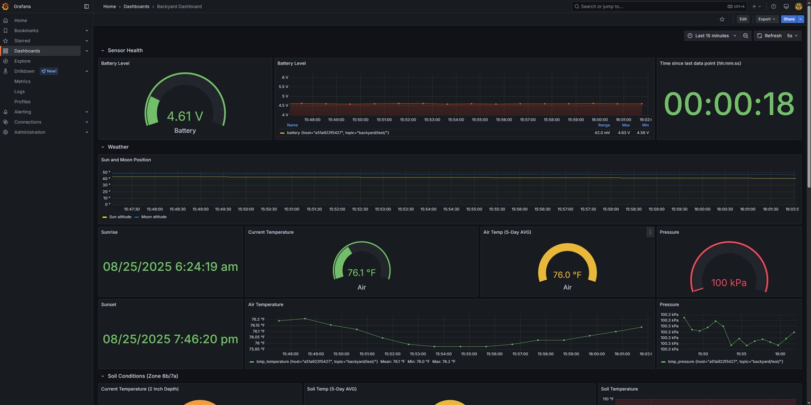
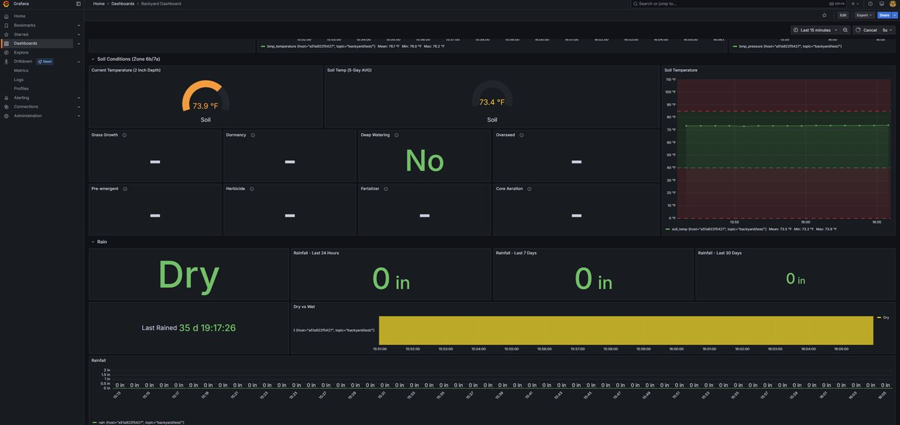

# ESP32 Rain Gauge Weather Station

A comprehensive weather monitoring system built on the ESP32 platform that measures rainfall, temperature, pressure, and battery levels with wireless data transmission via MQTT. A full backend environment is deployed locally to collect and monitor this weather data and present it to the user in grafana. 

## Features

- **Rain Gauge Monitoring**: Precision rainfall measurement using tipping bucket sensor
- **Environmental Sensors**:
  - Soil temperature (DS18B20 OneWire sensor)
  - Atmospheric temperature and pressure (BMP280 I2C sensor)
  - Battery voltage monitoring
- **Low Power Design**: Deep sleep functionality with sensor-triggered wake-up
- **Wireless Connectivity**: WiFi with static IP configuration and MQTT data transmission
- **Over-The-Air Updates**: OTA programming support for remote firmware updates
- **Debug Mode**: Pin-controlled debug mode for development and testing

## Hardware Requirements

- ESP32 Development Board
- Tipping bucket rain gauge (connected to GPIO 27)
- DS18B20 temperature sensor with 4.7K pull-up resistor (GPIO 33)
- BMP280 temperature/pressure sensor (I2C)
- Battery monitoring circuit (connected to A1)
- Debug mode switch (GPIO 12)

## Software Dependencies

- Arduino IDE with ESP32 support
- Libraries:
  - WiFi
  - PubSubClient (MQTT)
  - ArduinoJson
  - ArduinoOTA
  - OneWire
  - Adafruit_BMP280

## Configuration

1. Copy `Secrets-example.h` to `Secrets.h`
2. Update `Secrets.h` with your specific configuration:
   - WiFi credentials and network settings
   - MQTT broker details
   - OTA settings

## Operation Modes

### Normal Mode (Deep Sleep)
- Wakes up every 60 seconds (configurable) to collect and transmit sensor data
- Enters deep sleep between measurements for battery conservation
- Rain events trigger immediate wake-up via interrupt

### Debug Mode
- Activated by grounding GPIO 12 at startup (using a switch)
- Enables OTA programming
- Prevents deep sleep for continuous operation
- Exit Debug mode by opening the switch (will go back into deep sleep)

## Data Output

The system transmits JSON-formatted data via MQTT containing:
- Rainfall measurements
- Temperature readings (soil and atmospheric)
- Atmospheric pressure
- Battery voltage levels
- Sensor status information

---

# Backend Data Infrastructure

This project uses a complete Docker-based backend infrastructure for collecting, storing, and visualizing data from the ESP32 Rain Gauge Weather Station. The backend consists of four main services that work together to create a comprehensive IoT data pipeline.

## Backend Architecture Overview

```
ESP32 → MQTT Broker → Telegraf → InfluxDB → Grafana
       (Mosquitto)   (Collector)  (Database)  (Visualization)
```

## Backend Components

### 🦟 Eclipse Mosquitto (MQTT Broker)
- **Purpose**: Receives MQTT messages from ESP32 sensors
- **Port**: 1883 (MQTT), 9001 (WebSocket)
- **Configuration**: Allows anonymous connections for development
- **Topics**: Listens to `paper_wifi/test/#` and `backyard/#`

### 📊 InfluxDB (Time Series Database)
- **Purpose**: Stores sensor data in time-series format optimized for IoT metrics
- **Port**: 8086 (HTTP API)
- **Version**: InfluxDB v2 with Flux query language
- **Features**:
  - Automatic retention policies
  - Built-in data compression
  - High-performance time-series queries

### 📡 Telegraf (Data Collector Agent)
- **Purpose**: Bridges MQTT data to InfluxDB
- **Configuration**: 
  - Collects from Mosquitto every 10 seconds
  - Parses JSON data format from sensors
  - Outputs to both InfluxDB and stdout for debugging

### 📈 Grafana (Visualization Dashboard)
- **Purpose**: Creates real-time dashboards and alerts
- **Port**: 3000 (Web Interface)
- **Features**:
  - Pre-configured InfluxDB data source
  - Automatic dashboard provisioning
  - Real-time sensor monitoring

#### Grafana Dashboard Screenshots


*Main weather monitoring dashboard showing real-time sensor data*


*Detailed view of weather metrics and historical trends*

### 🔍 MQTT Explorer (Optional Monitoring)
- **Purpose**: Debug and monitor MQTT traffic
- **Port**: 9002 (Web Interface)
- **Features**: Real-time MQTT message inspection

## Backend Setup Instructions

### Prerequisites
- Docker and Docker Compose installed
- At least 2GB RAM available
- Ports 1883, 3000, 8086, 9001, 9002 available

### Quick Start

## Install docker

```
sudo apt install docker.io
sudo apt install docker-compose 
```

```
sudo usermod -aG docker iothon
```

## Setup the backend (docker config made by Miceuz)


1. **Clone the backend configuration**:
```bash
git clone https://github.com/Miceuz/docker-compose-mosquitto-influxdb-telegraf-grafana.git
```
See the readme in the above repo for more help on setup.

2. **Start all services**:
```bash
docker-compose up -d
```

3. **Verify services are running**:
```bash
docker ps
```
You should see 5 containers: mosquitto, influxdb, telegraf, grafana, and mqtt-explorer.

### Service Access

| Service | URL | Credentials |
|---------|-----|-------------|
| Grafana Dashboard | http://localhost:3000 | admin:admin |
| InfluxDB UI | http://localhost:8086 | user:password |
| MQTT Explorer | http://localhost:9002 | None |

### Testing the Backend

1. **Send test data to MQTT**:
```bash
# Using Docker
docker exec mosquitto mosquitto_pub -t 'paper_wifi/test/' -m '{"humidity":65, "temperature":22.5, "battery_voltage_mv":3200, "pressure":1013.25}'

# Or using mosquitto_pub if installed locally
mosquitto_pub -h localhost -t 'paper_wifi/test/' -m '{"humidity":65, "temperature":22.5, "battery_voltage_mv":3200}'
```

2. **Verify data in Grafana**:
   - Open http://localhost:3000
   - Login with admin:admin if still on the default
   - Navigate to dashboards to see your sensor data

3. **Check InfluxDB data**:
   - Open http://localhost:8086
   - Use Data Explorer to query your data using Flux

## Configuration Files

### Docker Compose Configuration
Key environment variables in `docker-compose.yml`:
- **InfluxDB Setup**: Organization, bucket, and admin token
- **Network**: Internal `iot` network for service communication
- **Volumes**: Persistent storage for InfluxDB and Grafana data

### Telegraf Configuration (`telegraf.conf`)
- **Input Plugin**: MQTT Consumer listening to sensor topics
- **Output Plugin**: InfluxDB v2 with authentication token
- **Data Processing**: JSON parsing with 10-second collection intervals

### Mosquitto Configuration (`mosquitto.conf`)
- **Security**: Anonymous connections enabled (development mode)
- **Ports**: Standard MQTT (1883) and WebSocket (9001)

### Grafana Provisioning
- **Data Source**: Auto-configured InfluxDB connection
- **Dashboards**: Automatically loaded sensor monitoring dashboards

## Security Considerations

⚠️ **Important**: The default configuration uses development-friendly settings:

- **Default Credentials**: Change all default passwords before production use
- **MQTT Security**: Anonymous access enabled - implement authentication for production
- **API Tokens**: The InfluxDB admin token is hardcoded - regenerate for production
- **Network**: Consider firewall rules for exposed ports

### Production Hardening
This project is currently run on a local server and not exposed to the internet. If you do run it out in the wild (at your own risk), you should probably do the following:
1. **Generate new InfluxDB admin token**:
```bash
# This token appears in docker-compose.yml, telegraf.conf, and grafana datasource
DOCKER_INFLUXDB_INIT_ADMIN_TOKEN=your-new-secure-token-here
```

2. **Enable MQTT authentication** in `mosquitto.conf`
3. **Use Docker secrets** for sensitive configuration
4. **Configure SSL/TLS** for production deployments

### Monitoring Commands
```bash
# Check all container status
docker-compose ps

# View logs for specific service
docker-compose logs -f grafana

# Restart a service
docker-compose restart telegraf

# Stop all services
docker-compose down

# Reset everything (removes data)
docker-compose down -v
```

## Data Schema

The backend expects JSON data from ESP32 sensors in this format:
```json
{
  "rain": 0.024,           // inches of rainfall in last hour
  "soil_temp": 72.5,       // soil temperature in Fahrenheit
  "bmp_temperature": 75.2, // air temperature in Fahrenheit
  "bmp_pressure": 101325,  // atmospheric pressure in Pascals
  "battery": 3.7           // battery voltage
}
```

Telegraf automatically adds metadata:
- Timestamp (precise to nanoseconds)
- MQTT topic as tags
- Host information

## Scaling and Performance

- **InfluxDB**: Handles millions of points per second
- **Telegraf**: Buffers up to 10,000 metrics in memory
- **Mosquitto**: Supports thousands of concurrent connections
- **Resource Usage**: Typical setup uses ~500MB RAM

For high-volume deployments, consider:
- InfluxDB clustering
- Telegraf horizontal scaling
- Load balancing for Mosquitto

## Integration with RainGauge ESP32

To connect your ESP32 RainGauge to this backend:

1. **Update ESP32 MQTT settings** in `Secrets.h`:
```cpp
#define MQTT_SERVER "your-backend-server-ip"
#define MQTT_PORT 1883
#define MQTT_TOPIC "paper_wifi/test/"  // or "backyard/"
```

2. **Ensure JSON data format** matches expected schema
3. **Test connectivity** using MQTT Explorer before deploying

The backend is configured to automatically collect any data published to the monitored MQTT topics and store it in InfluxDB for visualization in Grafana.