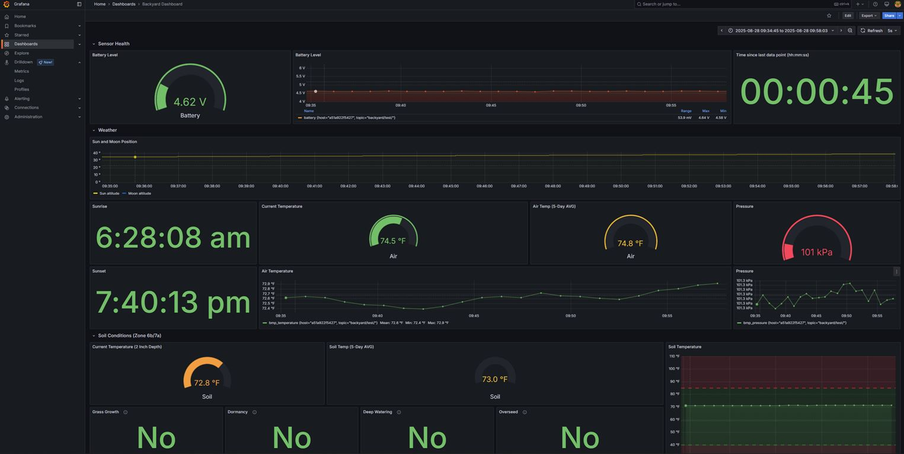
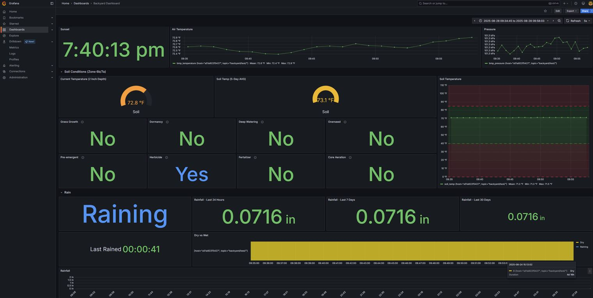

# ESP32 Rain Gauge Weather Station

A comprehensive weather monitoring system built on ESP32 that measures rainfall, temperature, pressure, and battery levels with wireless MQTT transmission and full backend visualization.

## Features

- **Rain Gauge**: Precision rainfall measurement using tipping bucket sensor
- **Environmental Sensors**: Soil temperature (DS18B20), atmospheric temp/pressure (BMP280), battery monitoring
- **Low Power Design**: Deep sleep with sensor wake-up triggers
- **Connectivity**: WiFi with MQTT data transmission and OTA updates
- **Debug Mode**: Switch-controlled debug mode for development
- **Docker Backend**:
 ESP32 → MQTT → Telegraf → InfluxDB → Grafana

## Hardware Requirements

- ESP32 Development Board
- Tipping bucket rain gauge (GPIO 27)
- DS18B20 temperature sensor with 4.7K pull-up (GPIO 33)
- BMP280 temperature/pressure sensor (I2C)
- Battery monitoring circuit (A1)
- Debug mode switch (GPIO 12)

## Software Setup

1. Install Arduino IDE with ESP32 support
2. Install libraries: WiFi, PubSubClient, ArduinoJson, ArduinoOTA, OneWire, Adafruit_BMP280
3. Copy `Secrets-example.h` to `Secrets.h` and configure your WiFi/MQTT settings

## Operation Modes

### Run Mode
- Wakes every 60 seconds to collect/transmit data (user configurable)
- Deep sleep between timed measurements for battery conservation
- Rain triggers ext. interrupt wake-up events for measuring rainfall

### Debug Mode
- Activated by grounding GPIO 12 at startup (on wakeup) via a switch
- Enables OTA programming and prevents sleep
- Exit by flipping the switch at any time

---

# Backend Infrastructure

Complete Docker-based data pipeline: **ESP32 → MQTT → Telegraf → InfluxDB → Grafana**


*Real-time weather monitoring dashboard*


*Detailed metrics, historical trends, and yard work recomendations based on those trends*

## Components

| Service | Purpose | Port | Access |
|---------|---------|------|--------|
| **Mosquitto** | MQTT Broker | 1883 | ESP32 data ingestion |
| **InfluxDB** | Time-series database | 8086 | admin:password |
| **Telegraf** | Data collector | - | Bridges MQTT to InfluxDB |
| **Grafana** | Visualization | 3000 | admin:admin |

## Quick Backend Setup

1. **Install Docker**:
```bash
sudo apt install docker.io docker-compose
sudo usermod -aG docker $USER
```

2. **Deploy Backend**:
```bash
git clone https://github.com/Miceuz/docker-compose-mosquitto-influxdb-telegraf-grafana.git
cd docker-compose-mosquitto-influxdb-telegraf-grafana
docker-compose up -d
```

3. **Verify Services**:
```bash
docker ps  # Should show 4-5 containers running
```

4. **Access Dashboards**:
   - Grafana: http://localhost:3000 
   - InfluxDB: http://localhost:8086

## Testing

Send test data to verify the pipeline:
```bash
docker exec mosquitto mosquitto_pub -t 'backyard/test/' -m '{"rain":0.024,"soil_temp":72.5,"bmp_temperature":75.2,"bmp_pressure":101325,"battery":3.7}'
```

## ESP32 Configuration

Update `Secrets.h` to connect to your backend:
```cpp
#define MQTT_SERVER "your-backend-server-ip"
#define MQTT_PORT 1883
#define MQTT_TOPIC "backyard/test/"
```

## Data Format

ESP32 transmits JSON data:
```json
{
  "rain": 0.024,           // inches of rainfall
  "soil_temp": 72.5,       // soil temperature (°F)
  "bmp_temperature": 75.2, // air temperature (°F)  
  "bmp_pressure": 101325,  // pressure (Pa)
  "battery": 3.7           // battery voltage
}
```

## Security Notes

⚠️ **Development Setup**: Default configuration uses development-friendly settings for local deployment. For production I reccomend the following:
- Change all default passwords
- Enable MQTT authentication
- Regenerate InfluxDB tokens
- Configure SSL/TLS
